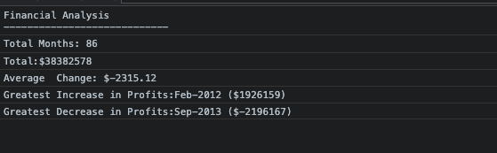

# **Console Finances**
## analyzing financial record
 
 

## **About The Project**

This Project is analyzing the financial records of a company,using **JavaScript**. The provided  financial dataset  is in the [index.js](index.js) file.The dataset composed of arrays with two fields, Date and Profit/Losses.
The code calculate each of the following
* The total number of months included in the dataset.
* The average of the changes in Profit/Losses over the entire period.
* Greatest Increase in Profits (current month-previous month).
* Greatest Decrease in Profits (current month-previous month).

The results of the analyzed data are shown below,and can be accessed by opening the Console in the browser.

The link to the webpage is [Console-Finance](https://asherbeck10.github.io/Console-Finances/)
 
 

## **Getting Started**

* Open the the link  above in a Chrome browser.You should get a welcome page "Open the Console
  to See the Results".
* You can open the Console by using the Chrome menu. You can use Option + ⌘ + J (on macOS),
  or Shift + CTRL + J (on Windows).
* and "here it is !!!"
 
 

## **Credits**
https://developer.mozilla.org/en-US/docs/Web/JavaScript/Reference/Global_Objects/Array

